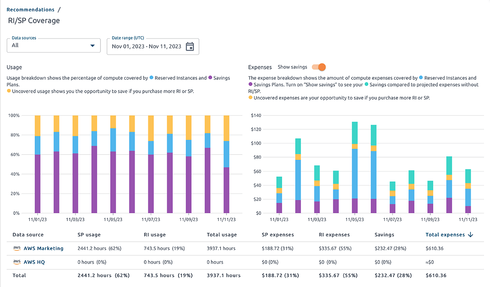
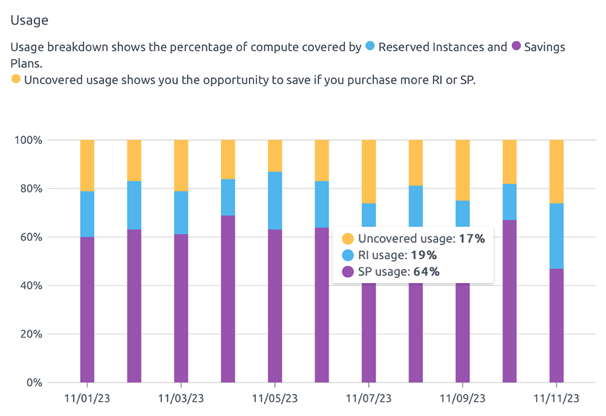
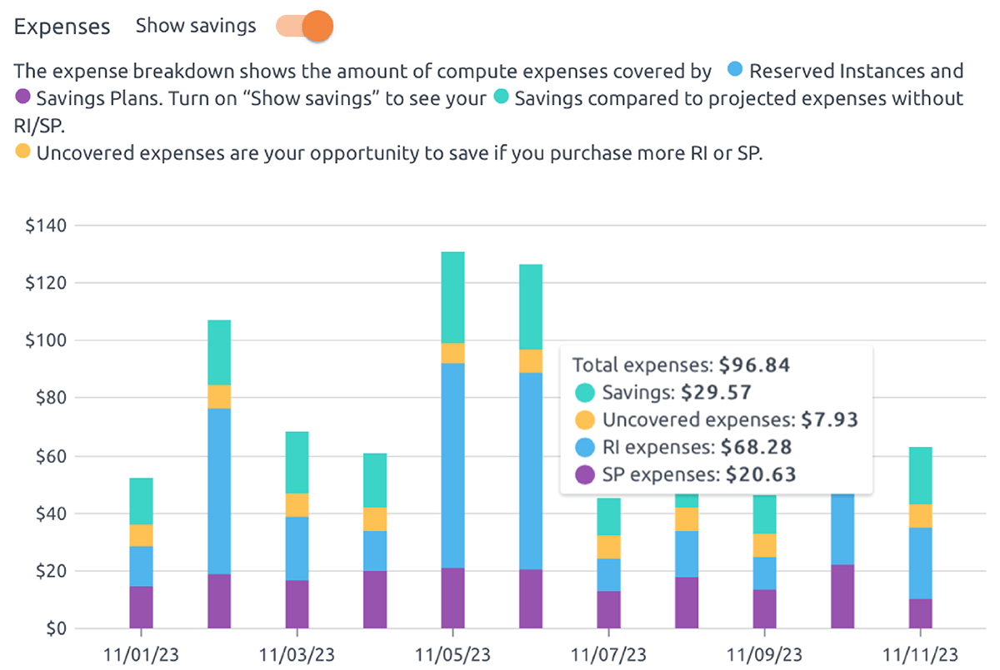
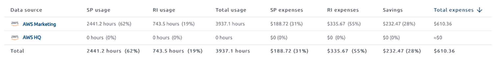
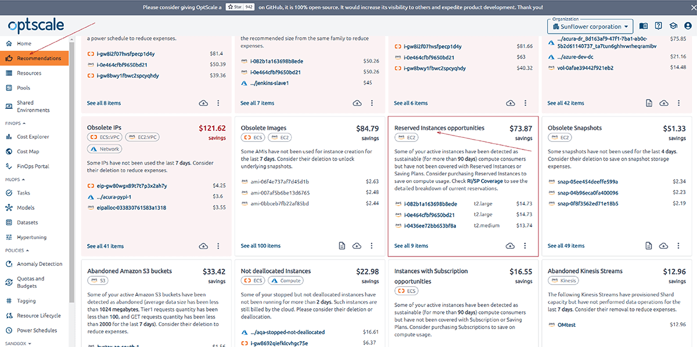
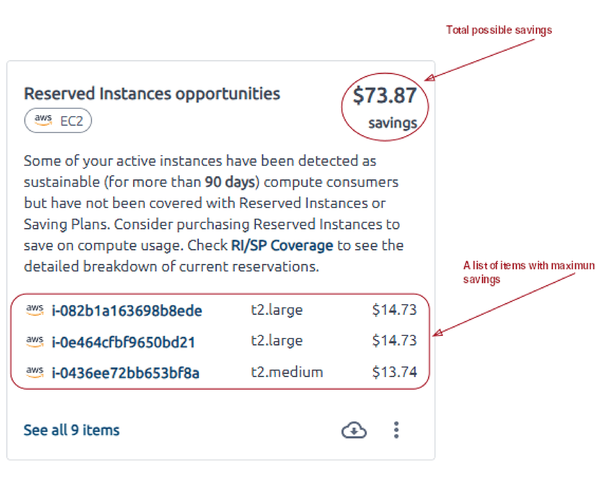
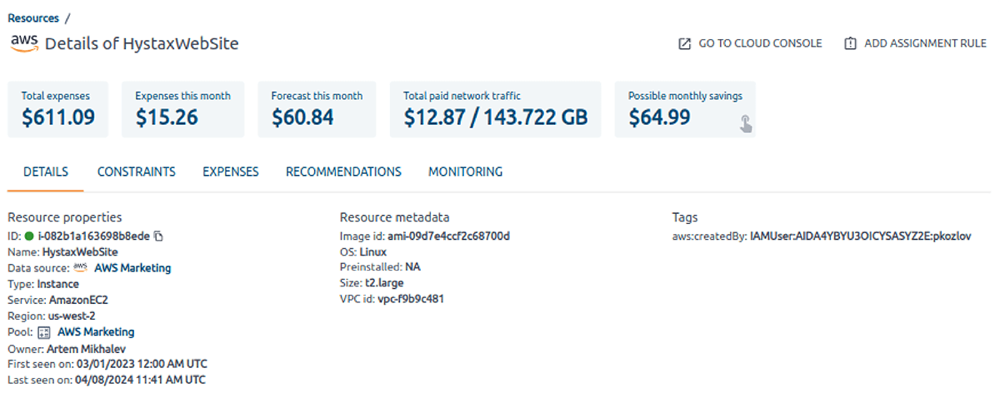
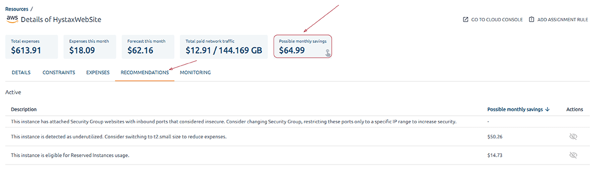

Hystax has been developing OptScale, an MLOps & FinOps open source platform. The software is fully available as a free source code on the [GitHub page](https://github.com/hystax/optscale) for download and deployment. OptScale aims to monitor and optimize cloud expenses, performance, and cloud and machine learning operations by analyzing cloud usage, profiling, and application instrumentation and providing valuable recommendations for optimization. Moreover, the MLOps capabilities of OptScale enable ML/AI teams by offering features for experiment tracking, hyperparameter tuning, performance optimization, and cost management, contributing to more streamlined and cost-effective compute operations.

The how-to article below will show how OptScale enhances RI/SP utilization by ML/AI teams in practice.

# How to use OptScale to optimize RI/SP usage for ML/AI teams

   
 

 
Machine Learning (ML) and Artificial Intelligence (AI) projects often leverage cloud technologies due to their scalability, accessibility, and ease of deployment. Integrating ML/AI projects with AWS Reserved Instances (RIs) and Savings Plans (SPs) can benefit from AWS Reserved Instances and Savings Plans by optimizing cost savings, resource utilization, and performance for various use cases ranging from model training and inference to real-time data processing and big data analytics.

Amazon EC2 Reserved Instances enable your organization to commit to usage parameters at purchase to achieve a lower hourly rate.

It is essential for ML/AI workloads, as training and hyperparameter tuning are constantly launched on the same instance types. Consistent instance types help ensure the reproducibility of results. If the same instance types are used across different runs of experiments, the chances of variations due to hardware differences are minimized. In addition, by using the same instance types, you can optimize resource utilization more effectively and produce a fair comparison between different models or hyperparameter configurations.

If you can forecast your guaranteed usage and utilize OptScale recommendations for better RI/SP usage, you can save a double-digit percentage (sometimes up to 72 percent – wow!!!) of your monthly cloud spend. This leads to more innovation and experiments you can run within the same budget.

OptScale offers various features tailored to this purpose. Let’s take a look at some of them.

## How to see RI/SP coverage?
Go to the ‘Recommendations’ tab of the solution. Find the summary card in ‘See RI/SP coverage.’ It shows the amount of money saved with commitments for the last 30 days and the percentage of computed expenses covered with commitments. Click on it to get detailed information.

  
 
   

 

The page ‘RI/SP coverage’ shows two breakdowns by usage and expenses. You can filter data output by data sources and/or date range. Hover your cursor over the data column of the chart, and detailed information will appear.
 

  
 
   

 

Usage breakdown shows the compute percentage covered by Reserved Instances and Savings Plans. Uncovered usage shows your opportunity to save if you purchase more RI or SP.

  
 
   

                                                                                                                      
The expense breakdown shows the amount of compute covered by Reserved Instances and Savings Plans. Turn on ‘Show Savings’ to see your Savings compared to projected expenses without RI/SP. Uncovered expenses are your opportunity to save if you purchase more RI or SP.

  
 
   

The information provided in the diagrams is shown in the table below. Information for each data source is displayed separately and summarized.

  
 
   

## How to get recommendations from OptScale for optimal usage of RI/SP?
Go to the ‘Reserved Instances opportunities’ card on the ‘Recommendations’ page to get tangible recommendations from OptScale for optimal RI/SP usage. The OptScale solution shows active instances detected as sustainable (for more than 90 days) compute consumers but have not been covered with Research Instances or Savings Plans.

  
 
   

 
The card shows the total amount of savings and a list of items with maximum savings. Below is a link to all the items found.

  
 
   

Follow the link ‘See all items’ to view the saving opportunities with minimal commitment and savings with average commitment for each item. Active, dismissed, and excluded items are separated into tabs.

To view detailed information about an item, click on it here or on the ‘Reserved Instances opportunities’ card.

  
 
   

 

You’ll find total expenses, the expenses of the current month, the forecast of the current month, total paid network traffic, and possible monthly saving cards. For convenience, the information about the item is grouped into tabs. Find your saving opportunities on the ‘Recommendations’ tab or click the ‘Possible money savings’ card to get there.
 

  
 
   

 

By clicking, you will be taken to the ‘Recommendations’ tab. This tab contains a list of saving opportunities.
