<p align="center">
⭐ Drop a star to support OptScale ⭐
</p>

# FinOps and MLOps platform to run ML/AI and regular cloud workloads with optimal performance and cost
<p align="center">
<a href="documentation/images/cover-GitHub.png">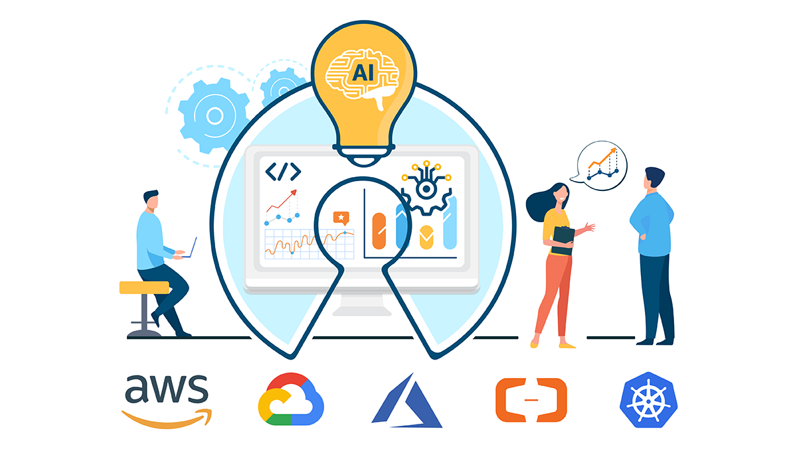</a>
</p>
OptScale is an open source FinOps and MLOps platform that provides cloud cost optimization for all types of organizations and MLOps capabilities like experiment tracking, model versioning, ML leaderboards.
<br>
<br>
<p align="center">
<a href="https://my.optscale.com/live-demo?emailbypass=true&utm_source=github&utm_medium=readme"></a>
</p>
<br>
<div align="center">

[](https://www.python.org/)
[](https://opensource.org/licenses/Apache-2.0)

 
   


    


</div>
<br>

## OptScale schema

<div align="center">
  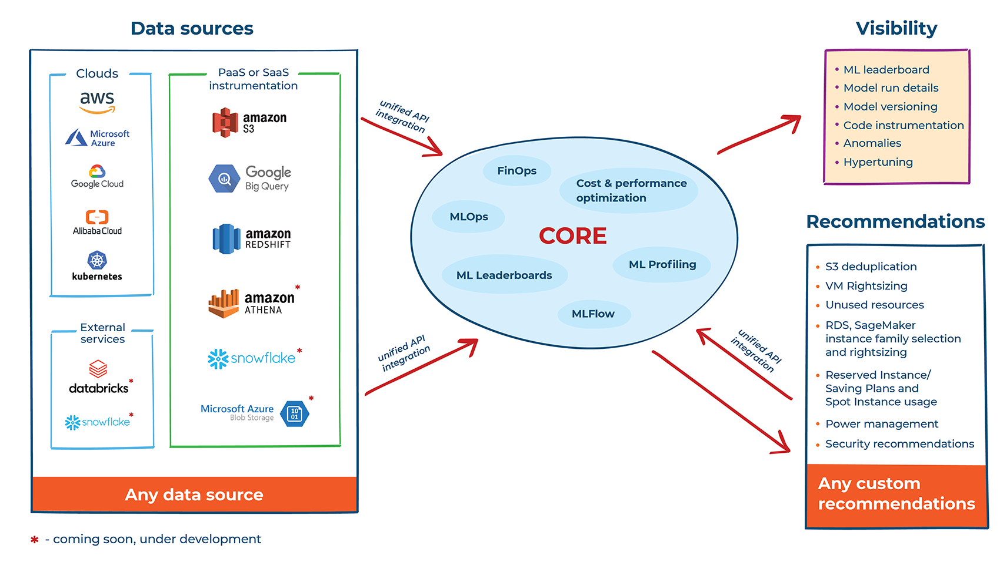
<br>
  <br>
</div>

<div align="left">
  <table border="1px">
    <tbody>
      <tr>
        <th>MLOps capabilities</th>
        <th>FinOps and cloud cost optimization</th>
      </tr>
      <tr>
        <td>
          <ul>
            <li>ML Leaderboards with candidates and qualifications</li>
            <li>Dataset and model tracking and versioning</li>
            <li>Run metrics and experiment tracker</li>
            <li>Hypertuning integrated with Optuna</li>
            <li>Training launcher</li>
            <li>ML Model training profiler</li>
            </ul>
          </td>
        <td>
          <ul>
            <li>Optimal utilization of Reserved Instances, Savings Plans, and Spot Instances</li>
            <li>Unused resource detection</li>
            <li>R&D resource power management and rightsizing</li>
            <li>S3 duplicate object finder</li>
            <li>Resource bottleneck identification</li>
            <li>Optimal instance type and family selection</li>
            <li>Databricks support</li>
            <li>S3 and Redshift instrumentation</li>
            <li>VM Power Schedules</li>
          </ul>
        </td>
      </tr>
    </tbody>
  </table>
</div>
  
You can check OptScale [live demo](https://my.optscale.com/live-demo) to explore product features on a pre-generated demo organization.

Learn more about the Hystax OptScale platform and its capabilities at [our website](https://hystax.com).

## Demos

|                                  ML Tasks                                  |                          ML Leaderboards                         |
| :------------------------------------------------------------------------: | :--------------------------------------------------------------: |
|     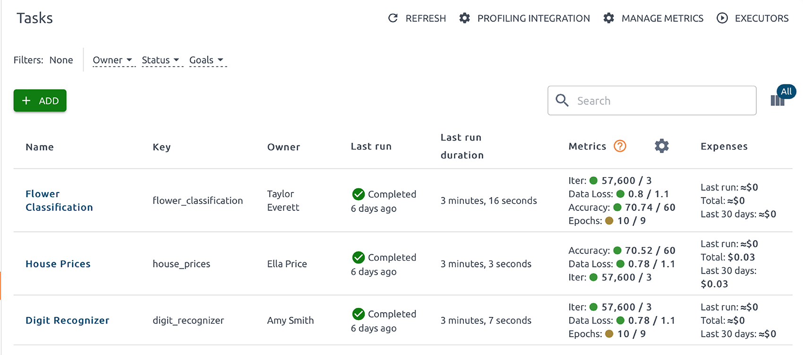     |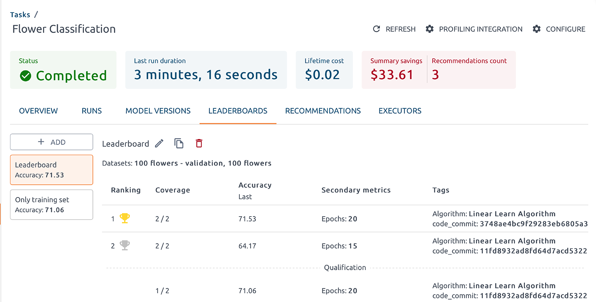  |


|                             Experiment tracking                            |                  ML model profiling integration                  |
| :------------------------------------------------------------------------: | :--------------------------------------------------------------: |
|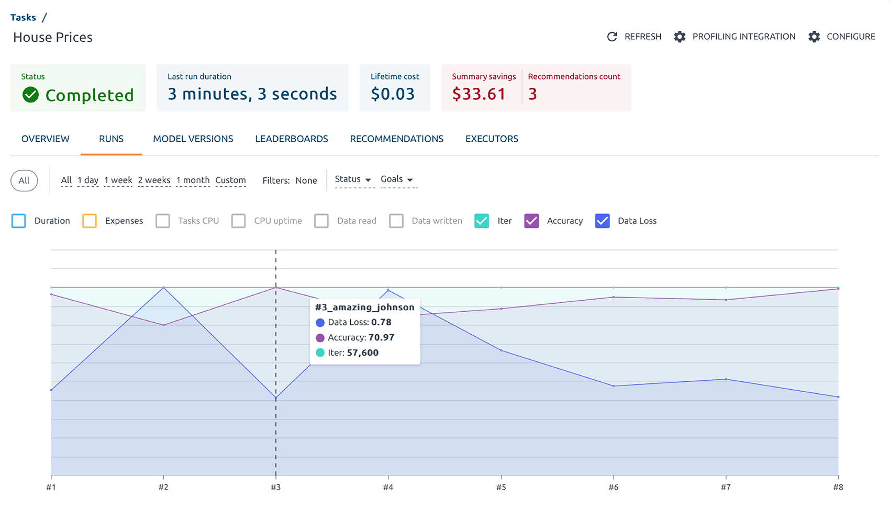   |     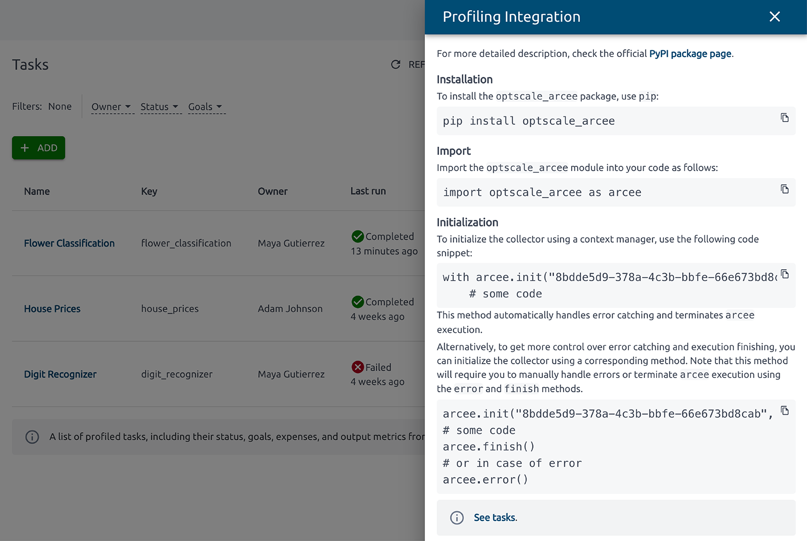   |
                                                                                                                      

|                                  Datasets                                  |                             Hypertuning                          |
| :------------------------------------------------------------------------: | :--------------------------------------------------------------: |
|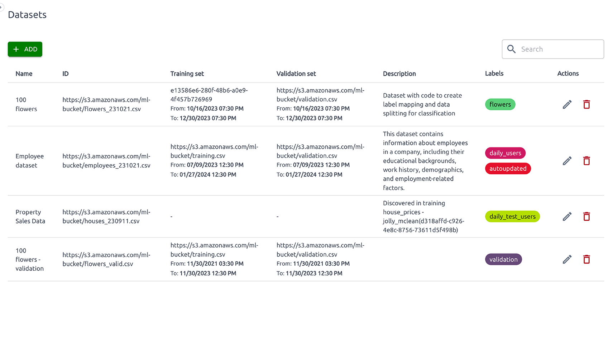              |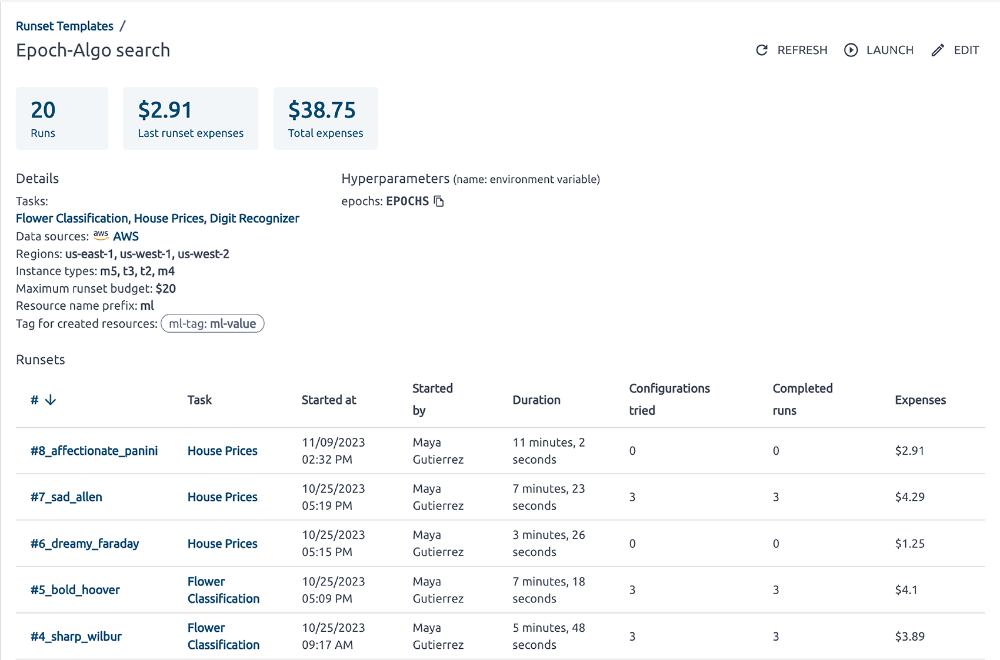 |  


|                             Databricks connection                          |                  Cost and performance recommendations            |
| :------------------------------------------------------------------------: | :--------------------------------------------------------------: |
|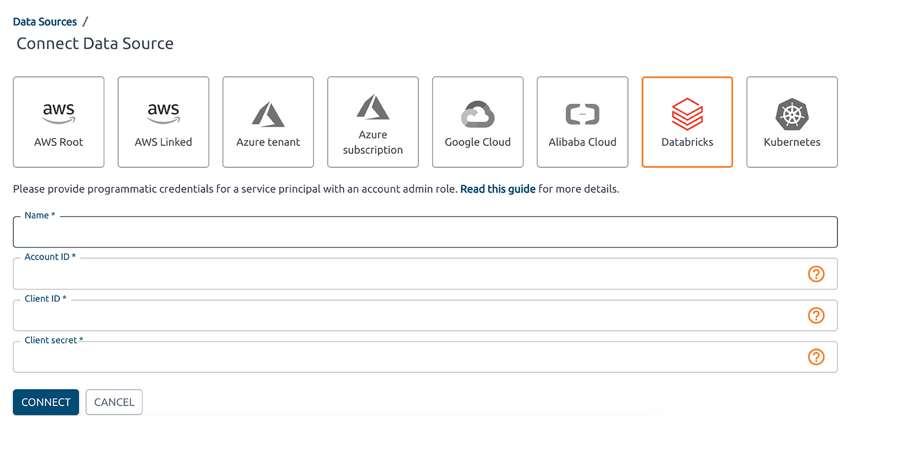 |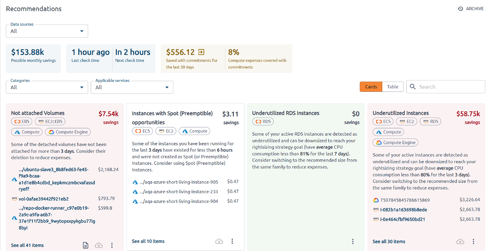  |


|                               Cost geo map                                 |                          VM Power Schedules                      |
| :------------------------------------------------------------------------: | :--------------------------------------------------------------: |
|  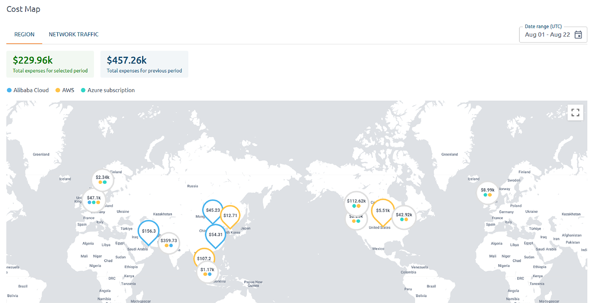                 | 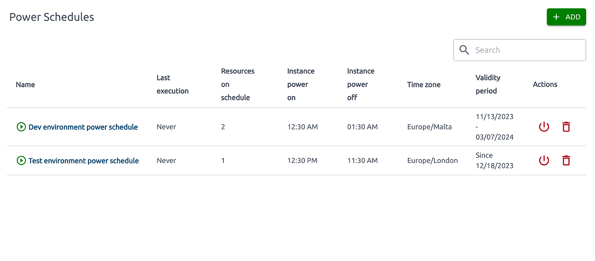 |


|                     Reserved Instances and Savings Plans                   |                          Cost breakdown by owner                 |
| :------------------------------------------------------------------------: | :--------------------------------------------------------------: |
|  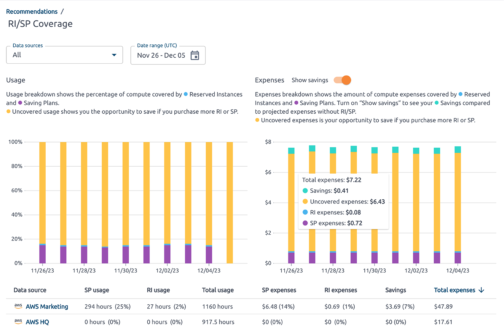               | 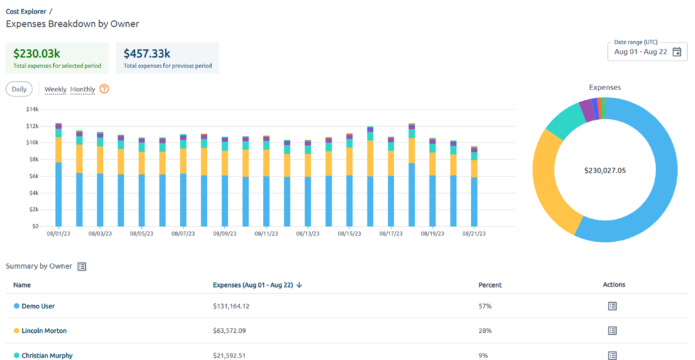 |


## OptScale components and architecture

<div align="center">
  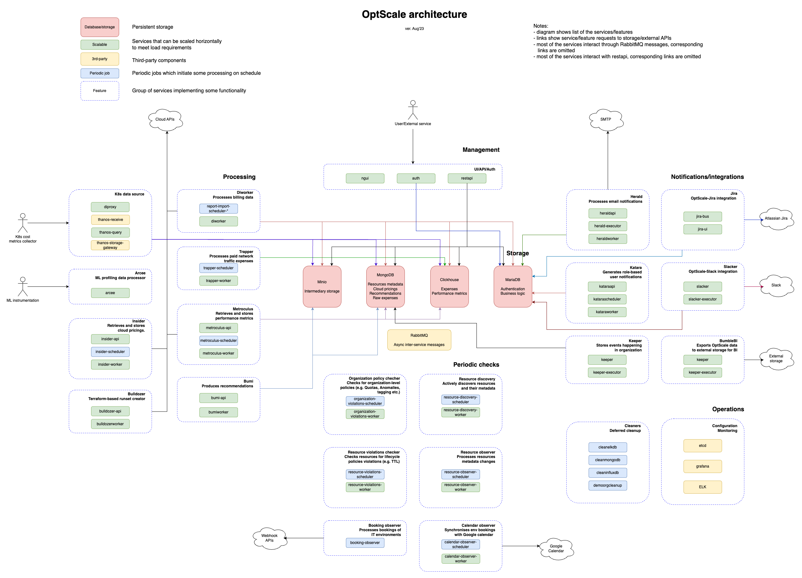
<br>
  <br>
</div>

## Getting started

Minimum hardware requirements for OptScale cluster: CPU: 8+ cores, RAM: 16Gb, SSD: 150+ Gb. 
 
NVMe SSD is recommended.  
**OS Required**: [Ubuntu 20.04](https://releases.ubuntu.com/focal/).  
*The current installation process does not work on Ubuntu 22.04*

#### Installing required packages
Run the following commands:
```
sudo apt update ; sudo apt install git python3-venv python3-dev sshpass
```
#### Pulling optscale-deploy scripts
Clone the repository
```markdown
git clone https://github.com/hystax/optscale.git
```

Change current directory:
```
cd optscale/optscale-deploy
```

#### Preparing virtual environment
Run the following commands:

```
python3 -m venv .venv
source .venv/bin/activate
pip install -r requirements.txt
```
#### Kubernetes installation
Run the following command:
**comma after ip address is required**
```
ansible-playbook -e "ansible_ssh_user=<user>" -k -K -i "<ip address>," ansible/k8s-master.yaml
```
where <user> - actual username; <ip address> - host ip address,
ip address should be private address of the machine, you can check it with
```
ip a
```
If your deployment server is the service-host server, add `"ansible_connection=local"` to the ansible command.

#### Creating user overlay
Edit file with overlay - [optscale-deploy/overlay/user_template.yml](optscale-deploy/overlay/user_template.yml); see comments in overlay file for guidance.


#### Cluster installation
run the following command:
```
./runkube.py --with-elk  -o overlay/user_template.yml -- <deployment name> <version>
```
or if you want to use socket:
```
./runkube.py --use-socket --with-elk  -o overlay/user_template.yml -- <deployment name> <version>

```

**deployment name** must follow the RFC 1123: https://kubernetes.io/docs/concepts/overview/working-with-objects/names/

**version**:
- Use hystax/optscale git tag (eg: 2023110701-public) if you use optscale public version.
- Use your own tag version if you build your optscale images (eg: latest).

**please note**: if you use key authentication, you should have the required key (id_rsa) on the machine


#### Cluster update
Run the following command:
```
./runkube.py --with-elk  --update-only -- <deployment name>  <version>
```

#### Get IP access http(s):
```markdown
kubectl get services --field-selector metadata.name=ngingress-nginx-ingress-controller
```

#### Troubleshooting

In case of the following error:
```
fatal: [172.22.24.157]: FAILED! => {"changed": true, "cmd": "kubeadm init --config /tmp/kubeadm-init.conf --upload-certs > kube_init.log", "delta": "0:00:00.936514", "end": "2022-11-30 09:42:18.304928", "msg": "non-zero return code", "rc": 1, "start": "2022-11-30 09:42:17.368414", "stderr": "W1130 09:42:17.461362  334184 validation.go:28] Cannot validate kube-proxy config - no validator is available\nW1130 09:42:17.461709  334184 validation.go:28] Cannot validate kubelet config - no validator is available\n\t[WARNING IsDockerSystemdCheck]: detected \"cgroupfs\" as the Docker cgroup driver. The recommended driver is \"systemd\". Please follow the guide at https://kubernetes.io/docs/setup/cri/\nerror execution phase preflight: [preflight] Some fatal errors occurred:\n\t[ERROR Port-6443]: Port 6443 is in use\n\t[ERROR Port-10259]: Port 10259 is in use\n\t[ERROR Port-10257]: Port 10257 is in use\n\t[ERROR FileAvailable--etc-kubernetes-manifests-kube-apiserver.yaml]: /etc/kubernetes/manifests/kube-apiserver.yaml already exists\n\t[ERROR FileAvailable--etc-kubernetes-manifests-kube-controller-manager.yaml]: /etc/kubernetes/manifests/kube-controller-manager.yaml already exists\n\t[ERROR FileAvailable--etc-kubernetes-manifests-kube-scheduler.yaml]: /etc/kubernetes/manifests/kube-scheduler.yaml already exists\n\t[ERROR FileAvailable--etc-kubernetes-manifests-etcd.yaml]: /etc/kubernetes/manifests/etcd.yaml already exists\n\t[ERROR Port-10250]: Port 10250 is in use\n\t[ERROR Port-2379]: Port 2379 is in use\n\t[ERROR Port-2380]: Port 2380 is in use\n\t[ERROR DirAvailable--var-lib-etcd]: /var/lib/etcd is not empty\n[preflight] If you know what you are doing, you can make a check non-fatal with `--ignore-preflight-errors=...`\nTo see the stack trace of this error execute with --v=5 or higher", "stderr_lines": ["W1130 09:42:17.461362  334184 validation.go:28] Cannot validate kube-proxy config - no validator is available", "W1130 09:42:17.461709  334184 validation.go:28] Cannot validate kubelet config - no validator is available", "\t[WARNING IsDockerSystemdCheck]: detected \"cgroupfs\" as the Docker cgroup driver. The recommended driver is \"systemd\". Please follow the guide at https://kubernetes.io/docs/setup/cri/", "error execution phase preflight: [preflight] Some fatal errors occurred:", "\t[ERROR Port-6443]: Port 6443 is in use", "\t[ERROR Port-10259]: Port 10259 is in use", "\t[ERROR Port-10257]: Port 10257 is in use", "\t[ERROR FileAvailable--etc-kubernetes-manifests-kube-apiserver.yaml]: /etc/kubernetes/manifests/kube-apiserver.yaml already exists", "\t[ERROR FileAvailable--etc-kubernetes-manifests-kube-controller-manager.yaml]: /etc/kubernetes/manifests/kube-controller-manager.yaml already exists", "\t[ERROR FileAvailable--etc-kubernetes-manifests-kube-scheduler.yaml]: /etc/kubernetes/manifests/kube-scheduler.yaml already exists", "\t[ERROR FileAvailable--etc-kubernetes-manifests-etcd.yaml]: /etc/kubernetes/manifests/etcd.yaml already exists", "\t[ERROR Port-10250]: Port 10250 is in use", "\t[ERROR Port-2379]: Port 2379 is in use", "\t[ERROR Port-2380]: Port 2380 is in use", "\t[ERROR DirAvailable--var-lib-etcd]: /var/lib/etcd is not empty", "[preflight] If you know what you are doing, you can make a check non-fatal with `--ignore-preflight-errors=...`", "To see the stack trace of this error execute with --v=5 or higher"], "stdout": "", "stdout_lines": []}
```
run the following command to reset k8s and retry the installation command:
```
sudo kubeadm reset -f
ansible-playbook -e "ansible_ssh_user=<user>" -k -K -i "<ip address>," ansible/k8s-master.yaml
```

In case of the following error during cluster initialization:
```
requests.exceptions.ConnectionError: HTTPConnectionPool(host='172.22.24.157', port=2376): Max retries exceeded with url: /v1.35/auth (Caused by NewConnectionError('<urllib3.connection.HTTPConnection object at 0x7f73ca7c3340>: Failed to establish a new connection: [Errno 111] Connection refused'))
```

check the docker port is opened:
```
sudo netstat -plnt | grep 2376
```
and open port in docker service config:
```
sudo nano /etc/systemd/system/docker.service
```
add this line (do not dorget to close docker port after installing Optscale)
```
ExecStart=/usr/bin/dockerd -H fd:// -H tcp://0.0.0.0:2376
```
then reload config and restart docker
```
sudo systemctl daemon-reload
sudo service docker restart
```

## Roadmap

- Cost plugin for MLflow, WanDB, and neptune.ai
- Integration with Optuna to optimize Reserved Instance and other hardware parameter usage
- Model versioning
- Better hardware selection recommendations based on usage patterns and algorithms

## Documentation

Read the [full OptScale documentation](https://hystax.com/documentation/optscale/) 📖

## Contributing

Please read and accept our [Contribution Agreement](CONTRIBUTING.md) before submitting pull requests.

## Community

Hystax drives FinOps & MLOps methodology and has crafted a community of FinOps-related people. The community discusses FinOps & MLOps best practices, our experts offer users how-tos and technical recommendations, and provide ongoing details and updates regarding the open-source OptScale solution.

You can check it out on [FinOps and MLOps in practice website](https://finopsinpractice.org/)

## Contacts

Feel free to reach out to us with questions, feedback, or ideas at info@hystax.com.
You can check out the latest news from Hystax at:

- [LinkedIn](https://www.linkedin.com/company/hystax)
- [Twitter](https://twitter.com/hystaxcom)
- [Facebook](https://www.facebook.com/hystax)
- [YouTube](https://www.youtube.com/channel/UCP12kM-jeS2yMglN_dT44lA)
