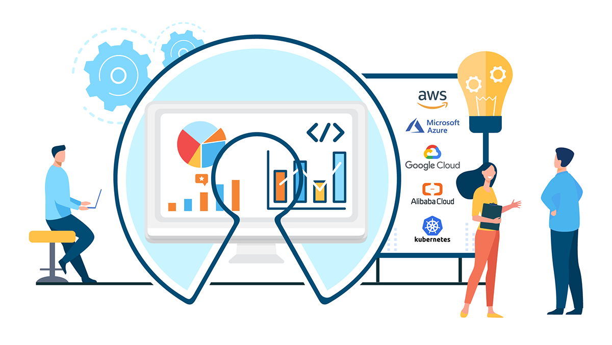

# OptScale - FinOps and multi-cloud cost optimization platform

OptScale is a solution to optimize cloud & Kubernetes costs and improve IT infrastructure usage by implementing various optimization scenarios and a FinOps strategy.

[Live Demo](https://my.optscale.com/live-demo)

## Overview

OptScale is available either in a form of open source code or as a [SaaS solution](https://my.optscale.com) hosted by Hystax team. The SaaS solution allows businesses of any size to optimize cloud & K8s costs and implement an efficient cloud usage experience, makes FinOps adoption more affordable than ever before.

Major features:
- FinOps assessment and adoption 
- Dozens of cost optimization scenarios (including VM rightsizing) and security recommendations 
- Cost allocation, budget constraints, daily limits and quotas with instant alerts
- Anomaly detection to avoid bill shocks 
- Kubernetes cost optimization and rightsizing 
- VM rightsizing engine and network traffic visualizer
- AWS, Microsoft Azure, Alibaba Cloud, GCP and Kubernetes are supported
  
You can check OptScale [live demo](https://my.optscale.com/live-demo) to explore product features on a pre-generated demo organization.

Learn more about the Hystax OptScale platform and its capabilities at [our website](https://hystax.com).

## Community

Hystax drives FinOps methodology, and has crafted a community of FinOps-related people. The community discusses FinOps and cost optimization best practices, our experts offer users how-tos and technical recommendations, and provide ongoing details and updates regarding the open source OptScale solution. 

You can check it out on [FinOps in practice website](https://finopsinpractice.org/)

## About Hystax

Our mission is to help companies in building a culture of efficient IT workload usage by providing all necessary instruments for test environments and cloud cost management. We offer OptScale designed as a B2B SaaS platform, that optimizes IT infrastructure cost and helps to enable FinOps practices, delivers complete visibility and control over Kubernetes, AWS, Microsoft Azure, GCP and Alibaba costs. Medium-sized and enterprise companies gain up to 45% of cloud cost savings in the first three months of product usage. The company was founded in 2016 and has customers in 48 countries. The most remarkable customers are Airbus, Nokia, Burger King, Bentley.

## Contacts

Feel free to reach us with questions, feedback or ideas at info@hystax.com.
You can check out the latest news from Hystax at:
- [LinkedIn](https://www.linkedin.com/company/hystax)
- [Twitter](https://twitter.com/hystaxcom)
- [Facebook](https://www.facebook.com/hystax)
- [YouTube](https://www.youtube.com/channel/UCP12kM-jeS2yMglN_dT44lA)
